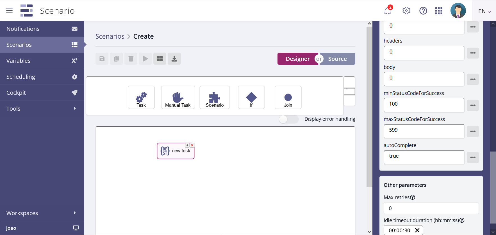
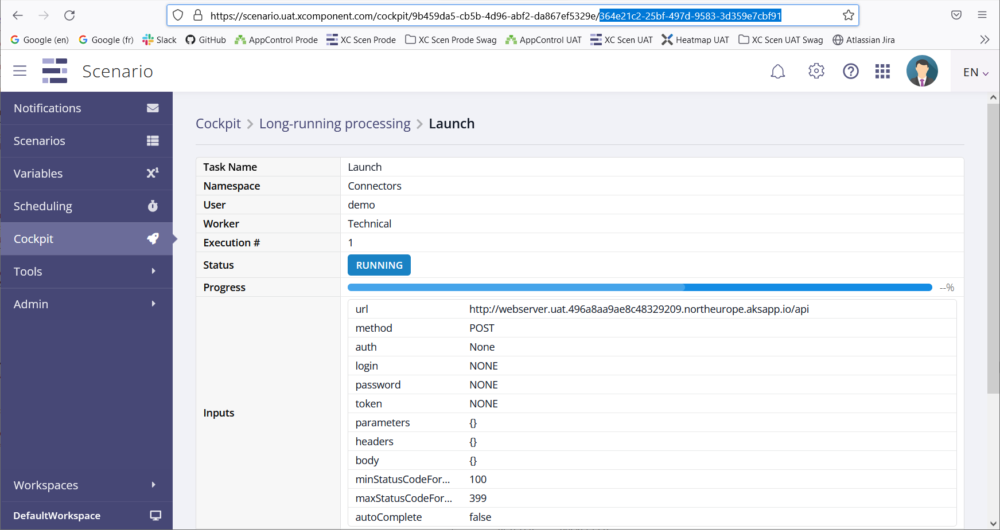

# Table of Contents

* [Introduction](#Introduction)
* [Avoiding auto-completion](#Avoiding-auto-completion)
* [Explicit completion from an external system](#Explicit-completion-from-an-external-system)
* [Finding the task instance id](#Finding-the-task-instance-id)

# Introduction

A common use case, when orchestrating complex workflows, is to launch a
long-running task through an HTTP call. Typically some existing system or
application supports a REST API, allowing us to request some processing to be
done by POST'ing the request with its parameters.

The HTTP POST operation itself terminates very quickly, returning an HTTP
status code to the caller (in our case, a Scenario Connectors/RestCall
task). The requested processing, on the other hand, can run for a very long
time period, measured in minutes or even hours.

From a functional point of view, the current task is the remote processing
being done, the HTTP call was just a means to trigger that. We typically want
to wait for that processing to finish before moving on to the next task. But
from a technical point of view, if the HTTP task is completed, X4B Scenario will
move on to the next task, this is not what we generally want.

This document describes a mechanism allowing X4B Scenario to wait for the
completion of some remote processing.

# Avoiding auto-completion

As of version 17, the Connectors/RestCall task includes an `autocomplete`
parameter, which defaults to true.



When true, the task is completed, in the Scenario sense, as soon as the HTTP
call returns. If set to false, the task remains in RUNNING status even after
the HTTP call has returned.

Note that if you want to use this facility, you should set an appropriate
`timeout` parameter. By default, if a task is not completed after 30 seconds,
Scenario puts it in ERROR status. To avoid that, either enter a sufficiently
long timeout value, or use zero to disable it entirely.

# Explicit completion from an external system

A running task can be completed through Scenario's REST API. The TaskStatus
endpoint includes the `POST /api/task-statuses` operation, with a JSON
parameter with the following structure:

``` console
{
  "taskInstanceId": "string",
  "status": "Unknown",
  "progressPercentage": 0,
  "message": "string",
  "invariants": {},
  "outputValues": {}
}
```

To complete a RestCall task with id 364e21c2-25bf-497d-9583-3d359e7cbf91, for
example, POST the following value:


``` console
{
  "taskInstanceId": "364e21c2-25bf-497d-9583-3d359e7cbf91",
  "status": "Completed",
  "message": "<use this field to provide a trace, or some form of documentation>",
  "outputValues": {
    "statusCode": "200"
  }
}
```

Note that the RestCall task requires a valid HTTP return code in the statusCode
property of the output.

## Sample code

A sample python script to complete a task is `complete_http.py`, you can find
the source on
this
[repository](https://github.com/xcomponent/scenario-documentation/tree/main/complete_http). Use
it with the following command :

``` console
	py complete_http.py <task_instance_id>
```

# Finding the task instance id

For an external system to be able to complete a RestCall task, it needs the
task's instance id. As a reminder, this is the dynamic id assigned by X4B
Scenario when the task is pushed onto the task queue. It can be seen on the
Cockpit page:



To allow external systems to access the task, X4B Scenario helpfully includes
this id in the HTTP header `X-Scenario-TaskInstanceId`. On the receiving side
of the HTTP POST call, the remote system can retrieve this header value, and
use it to build the json parameter to the TaskStatus POST call.

