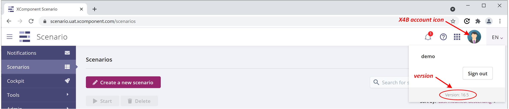
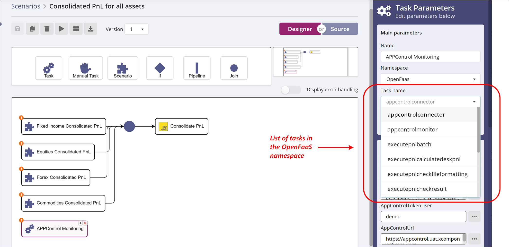
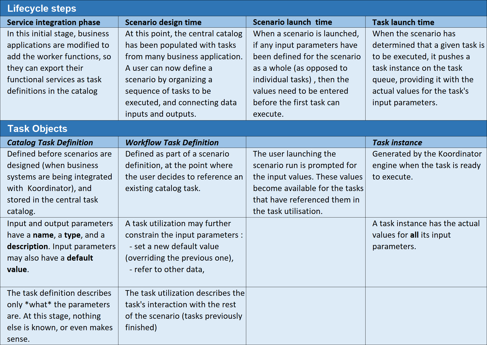
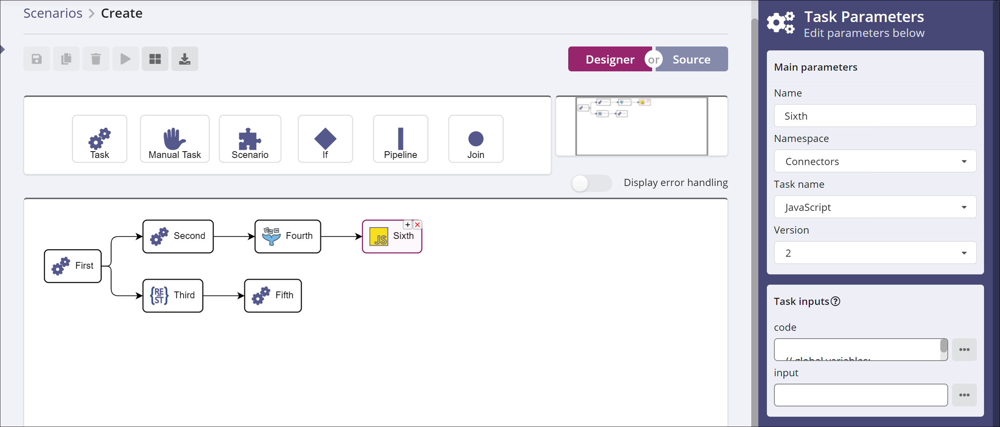
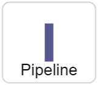

# XC Scenario Concepts

## Table of Contents

* [Introduction](#introduction)
  * [Software Version](#software-version)
  * [Documentation Overview](#documentation-overview)
* [General Description and Concepts](#general-description-and-concepts)
  * [Scenario](#Scenario)
  * [Workers and Integration Endpoints](#workers-and-integration-endpoints)
  * [The Worker API](#the-worker-api)
  * [User Interaction](#user-interaction)
* [Tasks](#tasks)
  * [Overview](#overview)
  * [The Task Catalog](#the-task-catalog)
  * [Namespaces](#namespaces)
  * [Task parameters](#task-parameters)
    * [Input parameters](#input-parameters)
	* [Output parameters](#output-parameters)
  * [Task aspects](#task-aspects)
    * [Three different aspects of tasks](#three-different-aspects-of-tasks)
	* [Tasks in the scenario lifecycle](#tasks-in-the-scenario-lifecycle)
  * [Task versions](#task-versions)
* [Scenario](#scenario)
  * [Scenario Definition](#scenario-definition)
    * [Task Pipelines](#task-pipelines)
	* [Scenario Invariants](#scenario-invariants)
	* [Scenario Re-Runs](#scenario-re-runs)
  * [Scenario Versions](#scenario-versions)
  * [Workflow Task Definition](#workflow-task-definition)
  * [Scenario Instance](#scenario-instance)
  * [Task Instance](#task-instance)
* [Worker](#worker)
  * [Retrieving tasks](#retrieving-tasks)
  * [Returning information](#returning-information)
* [User roles and rights](#user-roles-and-rights)
  * [User management](#user-management)
  * [Profiles](#profiles)
* [Workspaces](#workspaces)

# Introduction

This document is an introductory guide to the concepts underlying Invivoo’s XC
Scenario product, part of the X4B platform. You should read this document
first, before diving into the developer’s guide or the user’s guide.

## Software Version

This document corresponds to version 16.5 of the Scenario software. To check
what version of the software you're using, click on the **X4B account** icon on
the right of the X4B banner, at the top of your screen.

## Documentation Overview

The Scenario documentation is composed of several documents:
| Title	| Description |
| --- | --- |
| Concepts | The present document. A description of the general concepts that underlie the design and functioning of the Scenario software. |
| Installation and Administration Guide	| A guide to the installation, configuration, and running of the Scenario server software, destined for production support teams. |
| User’s Guide | A guide to Scenario’s graphical user interfaces (UI’s), destined to end users who will design, run, and monitor scenarios. |
| Developer’s Guide | A guide on how to integrate external systems with Scenario, by writing “worker” programs that execute tasks in the scenarios. |
| Data Dictionary | An Excel file, companion to the developer’s guide. It summarizes the REST API exposed by Scenario, for use by worker programs and users interfaces, and it details the data objects that are exchanged in API calls. |

# General Description and Concepts

## Scenario

Scenario is a general-purpose **_scenario_** builder and execution engine. A
scenario is an organized set of elementary tasks. Scenarios represent different
ways of organizing data, automated processes, or human activities. Scenarios
can represent a _workflow_ that models some business process, for instance; or
a _Gantt diagram_ in a Project Management context; or a _complex calculation_
broken down into smaller parts.

Scenario includes a graphical user interface (GUI, a web application) for
creating scenario definitions, as well as running actual instances of these
scenarios, monitoring their progress, and displaying various KPI’s.

Scenario exposes a number of HTTP REST API’s, through which the worker programs
can interact with the server. These API’s are described in the Scenario
Developer’s Guide.

## 	Workers and Integration Endpoints

Scenario does not by itself execute any business tasks. Tasks are executed by
pushing them onto a queue, where external programs called **workers** can pick
them up, and perform the required work. The Scenario Developer’s Guide
describes in full detail the implementation of worker programs, and their
interactions with the Scenario server. Following is a brief overview.

## The Worker API

Supposing that a system called **Pricing** is to be integrated with the
Scenario, so that its services can be invoked as part of some business process;
then the Pricing software needs to be modified to implement a Pricing worker,
which means coding API requests on the following endpoints:

* **Task catalog**: the worker pushes _task descriptions_ to the Scenario task
  catalog, thereby making these tasks available to the scenario designer and to
  the execution engine. Each task represents a unit of service that the Pricing
  system exposes to the outside world.

* **Task Polling**: workers poll this endpoint to retrieve _task instances_ to
  be executed. Tasks are pushed on the queue, by the central engine, whenever a
  scenario is being run, and they are tagged with the _namespace_ associated to
  the task definition (see [Namespaces](#Namespaces)). This ensures that every
  worker only retrieves the tasks that are meant for it.

* **Status notifications**: workers use this endpoint to notify Scenario of
  their termination, or of their intermediate progress status.

The above description makes the assumption that it is possible to modify the
existing software, with the result being that the worker is somehow _embedded_
in the functional system. Alternatively, there may be **legacy systems** for
which it is not possible (or not desirable, or too expensive) to change the
code. In this case, a _generic worker_ may be used to interface with the
Scenario, with tasks being defined and executed as scripts (python, shell,
…). The scripts in turn can use the legacy protocols to interact with the
legacy systems, giving you access to those systems’ functionality.

## User Interaction

The overall lifecycle of a user’s interaction with Scenario is as follows:
- Create a new scenario, by picking tasks from the task catalog, defining their
  inputs and outputs, and arranging the order of their execution. A scenario
  may consist of a simple enumeration of tasks, to be performed sequentially,
  or it can have more complex arrangements of tasks, such as `fork`, `join`,
  and `pipeline`, described in [Scenario Definition](#Scenario-Definition).
- Launch the execution of a scenario, specifying values for the input parameters.
- Monitor the progress of the scenario instance on the monitoring interface
  (called the “Cockpit”, see the User’s Guide eventually “zooming in” to review
  the state of individual tasks.
- Eventually re-run parts of the scenario, if it stops in an error situation

All these interactions take place through the Scenario User Interface, which is
a web application (webapp) described in the Scenario User’s Guide.

# Tasks

## Overview

A task in Scenario is the elementary unit of work. Tasks are executed when a
scenario is run, in an order defined by the scenario itself. Tasks have inputs
and outputs that can be viewed and used by a human user, or by another
task. Task parameters should not be confused with scenario parameters.

## The Task Catalog

Business applications provide the processing to actually implement and perform
the business tasks. In order for these applications to be usable from Scenario,
the application must publish the list of services that it provides in the form
of **task catalog**, defined by Scenario. This catalog is associated to a
given _namespace_ (see next paragraph) and it holds a set of **task
definitions** to be used in the business scenarios.

A user designing a scenario accesses the global Scenario task catalog to pick
tasks for inclusion in the scenario.

The figure below shows the user interface displaying the catalog of tasks
associated to a namespace called “OpenFaaS”.

## Namespaces

A _namespace_ is a free-form string identifier, that is used to group tasks
that are functionally related. A namespace is always specified when a task or
task catalog is created, and a task is always associated with one, and only
one, namespace. A task name must be _unique_ inside its namespace.

A worker polling the task queue must specify the namespace for which it is
retrieving tasks.

Namespaces are a mechanism to avoid name conflicts. Invivoo’s recommendation is
that each team responsible for a given system integrated in Scenario define
their own namespace. Users are responsible for the uniqueness of their
namespace, the server has no way to enforce this.

## Task parameters

Task may have input and output parameters specified. This is a powerful
mechanism for propagating data across the entire scenario graph. The catalog
defines the type of each input and output parameters.

### Input parameters

These can hold constant values, set at workflow design time, or they can hold
references to other input or output parameters of tasks already finished, or
references to the scenario’s own input parameters.

This mechanism for referencing other parameters is called _templating_. It’a
variable interpolation (or substitution) mechanism, with a special syntax for
variables that identify a specific parameter in another part of the
scenario. See the User’s Guide for practical details of how to reference other
parameters.

### Output parameters

These are the results of the task’s execution, computed by the systems to which
the workers have dispatched this execution. Outputs of a task may be referenced
by inputs of subsequent tasks.

##	Task aspects

### Three different aspects of tasks

From the Scenario engine’s point of view, each task has three different
aspects, based on when it appears in a scenario’s lifecycle:

* a **catalog task definition** identifies an elementary piece of functionality
  that is made available to Scenario by some application. Task definitions
  are created before any scenario is designed, when an application system is
  integrated in Scenario. Task definitions are stored in a central task
  catalog. A task definition describes the input and output parameters for each
  task: parameter _name_, _type_, and eventually a _default value_ for inputs.

* a **workflow task definition** (which could be called a _task utilization_)
  describes a specific use of a certain task definition from the catalog, in
  the context of a given scenario definition. To use a task in a scenario
  definition, the user must specify two things:
  * the **definition of the task** that is to be used (taken from the task catalog),
  * the **source of values** for the task’s input parameters, which can be either:
    * a hardcoded _default value_ (a constant) to be used in every instance of
      this scenario,
    * or a _reference_ to other scenario data:
      * the scenario’s input parameters,
      * the output parameters of other, previously-finished, tasks

* a **task instance** is created by the server when a running scenario reaches
  the point where this task should be utilized. To get the task executed, the
  Scenario will push the task instance onto a task queue, where the appropriate
  worker program will pick it up. A task instance has a reference to the task’s
  static definition, as well as a complete set of actual values for the input
  parameters.

### Tasks in the scenario lifecycle

The tables below show the correspondence between different moments in the
lifecycle of a scenario (from left to right), with the different task aspects
seen above.

## Task versions

Catalog task definitions are identified by **id** (internal) and **name**
(user-visible). The name should be unique inside the task’s namespace. Task
definitions _in the catalog_ also support a notion of **versioning** (workflow
task definitions and task instances _do not_). Users can create different
versions of the same task, by publishing an increased version number.

When a **workflow task definition** object is created as part of a scenario
definition, and a **task definition** reference is stored inside it, the latest
version is used by default, but the user can override this, and pick an older
version.

In this way, multiple versions of the same task can coexist across different
scenario definitions and running instances. Existing versions are not impacted
by newer versions of the same task.

# Scenario

A scenario in Scenario represents a business process, as a series of tasks
to be executed by the business applications that have been integrated with
Scenario.

## Scenario Definition

User design new scenarios using a graphical designer. This is a web
application, with access to the catalog of tasks, where users can place tasks
to be executed in order of precedence, designing a view of the business
scenario in the form of a graph (a DAG, actually: Directed Acyclic Graph).

Users select tasks from the catalog, and the catalog task definition gets
transformed into a workflow task definition (detailed
in [Task aspects](#Task-aspects) above) when it is included in a scenario
definition. Hundreds of scenario definitions can be created and stored in the
Scenario server.

Tasks may be arranged is several ways:
* connect several tasks in sequence, to be executed in that order
* connect one task to several others (fork). For example, in the the diagram
  below, First forks into Second and Third. When First completes its execution,
  all the tasks in the fork (in this case Second and Third) are started.
* connect many tasks to one, using the Join operator
* create a pipeline of calculations (see next paragraph)

Here’s a view of the Graphical Designer in action :

Please consult the Scenario User’s Guide for the detailed explanation of how to
use the graphical designer to design your scenarios.

### Task Pipelines

A task pipeline is a construct in the scenario designer that lets users
efficiently arrange calculations that involve very large sets of data, using a
streaming paradigm.

| Icon | Description |
| --- | --- |
|  | A pipeline has a top task (the initial one) and a bottom task (the final one). The top task splits its output into a large number of parallel streams, where the data flows are processed in parallel and independently of each other. The pipeline completes its execution when every stream has finished its own execution. |

Pipelines should only be used in situations involving truly large datasets, as
in a “Big Data” context.

### Scenario Invariants

To help verify the correct execution of complex scenarios, Scenario supports a
general mechanism using user-defined KPI’s called **invariants**. An invariant
is some KPI or metric calculated by different tasks in the scenario, where it
is expected that all tasks calculate the same value if execution is correct.

A typical example is a pipeline of calculations across a large number of
records: you can define the number of records processed to be an invariant. The
first task in the pipeline will store in its invariant the number of records
that it has sent down the pipeline, and the last task will store the number of
records it has actually received. The scenario execution will be successful
only if the two tasks compute the same number. Otherwise, the scenario goes
into error state, with the mention _Invariant Error_.

### Scenario Re-Runs

In many operational situations, scenarios may fail for a variety of reasons. If
the scenarios take a long time to execute, then it is essential to be able to
re-start and re-run easily only those parts that have not executed.

Scenario includes a very flexible re-run mechanism. First of all, when a task
is in error, tasks that do not depend on the failed task continue running to
completion. When everything that was “runnable” has finished running, the
scenario is stopped, with an “Error” status.

At this point, the user should investigate whatever caused the task failure,
and fix the issue. Then she has two options:
* Global re-run: every task that did not run or complete is run again.
* Selective re-run: choose which individual tasks will be run again.

See the User’s Guide for details of the user interface mechanisms available to
let the user choose the re-run options she wants to apply.

## Scenario Versions

The policy governing the versioning of scenario definitions is similar to the
one described in [Task versions](#Task-versions) for tasks.

Scenario definitions are identified by **id** (internal) and **name**
(user-visible). Scenario definitions also support a notion of
**versioning**. Scenario definition version numbers are managed by the
graphical designer tool, which increases the version number every time a “save”
is done.

When a scenario is launched, the user specifies which scenario definition is to
be used. The Scenario server then creates a _scenario instance_, in which the
latest version of the scenario definition is used by default, but the user can
override this, and pick an older version.

In this way, multiple versions of the same scenario definition can coexist
across different running instances. Existing versions are not impacted by newer
versions of the same scenario definition.

## Workflow Task Definition

This object is created when a user includes a catalog task definition in a
scenario being developed. The main difference with the catalog is that now the
user can indicate specific sources for the input values:
* A constant value, input by the user
* inputs of the scenario itself
* inputs or outputs of other tasks

In the current version, there is a templating syntax for the user to describe
the intended source (see User’s Guide). Future versions may include a more
user-friendly graphical tool for this.

## Scenario Instance

User can start a run of a given scenario, by selecting the scenario definition
from a list. At that point, if any input parameters have been defined, a popup
window will prompt the user to enter the values. From then on, this instance of
the scenario is running, meaning that the Scenario execution engine determines
what tasks are to be run at each moment, and it posts them to the task queue,
where workers will be able to retrieve them through the polling API.

## Task Instance

Every time the Scenario engine determines that a given task is ready to run,
the following steps are taken:
* A **task instance** object is created from the scenario object, and from the
  workflow task definition
* If inputs have been defined for this task:
  * the Scenario engine retrieves the actual values from the scenario/tasks
    inputs/outputs
  * the values are fed into the task’s inputs
* the task instance is pushed to the queue

# Worker

A **worker** is an external program that is not part of Scenario, but
implements the Scenario API (introduced in [The Worker API](#The-Worker-API)
above).

A worker usually is developed for a given external business system, or
application, when the business users have indicated that they need to invoke
functional services from this application. Usually a dedicated namespace is
defined for the application.

The next paragraphs offer a quick overview of the workings of a worker
program. See the Developer’s Guide and Data Dictionary for the complete
information on how to write and run a Scenario worker program.

## Retrieving tasks

Workers are background processes that run permanently, periodically polling the
task queue for task instances associated with their namespace.

When a matching task is found, the polling function (part of the REST API)
returns a tast instance object to the calling worker, with the list of inputs
values, as described in [Task parameters](#Task-parameters)
and [Task aspects](#Task-aspects) above. The worker uses this information to
call the requested application service, which executes the task.

## Returning information

When the task execution is done, the worker posts a **TaskStatusEvent** using
the REST API. This object lets the executing system return various kinds of
information to the Scenario server running this scenario:
* A _task execution status_, which may be **In Progress**, **Error**,
  **Completed**
* An _error level_, indicating the gravity of the error situation (see the Data
  Dictionary for details of the allowed values)
* A set of _output values_, corresponding to the task’s output parameters
* A set of _invariants_, if defined for this scenario, as described
  in [Scenario Invariants](#Scenario-Invariants) above.

# User roles and rights

## User management

Scenario recognizes two different types of users:
* **local users** have a username and password that they can use to log into
  the system through the web application. These credentials are stored locally
  in Scenario’s persistent storage.
* **normal users** authenticate themselves through SSO (Single Sign-On),
  meaning that the login interface redirects the user to a third-party system
  (the IDP, Identity Provider) where the user is known. If the user is
  successfully authenticated by the third-party system, Scenario will receive
  an authentication token, including one or more _client profiles_, which are
  mapped to _profiles_ in Scenario.

## Profiles

A **profile** in Scenario is associated with a number of _rights_, i.e. the
authorization to perform some action, or access some functionality. The current
version recognizes three basic rights:
* Admin
* Read
* Write

The Admin right includes all the permissions from the Read and Write rights,
and the Write right includes all the Read permissions.

Currently these three rights control the execution of the REST API
operations. Each operation in the swagger interface identifies the specific
right that is required to execute it. A right applies to each REST API
operation, regardless of the data objects involved: for example, if a user is
not allowed to start workflows, these applies to all workflows.

Future versions of Scenario may implement a wider set of profiles and rights,
and finer granularity.

# Workspaces

Workspaces are related to the commercial licensing issues of Scenario. Each
workspace will have a limit to the number of workflows that may be
created/designed/run in it. Invivoo delivers software license keys, which
encode the workflows and workspaces allowed for this license.
