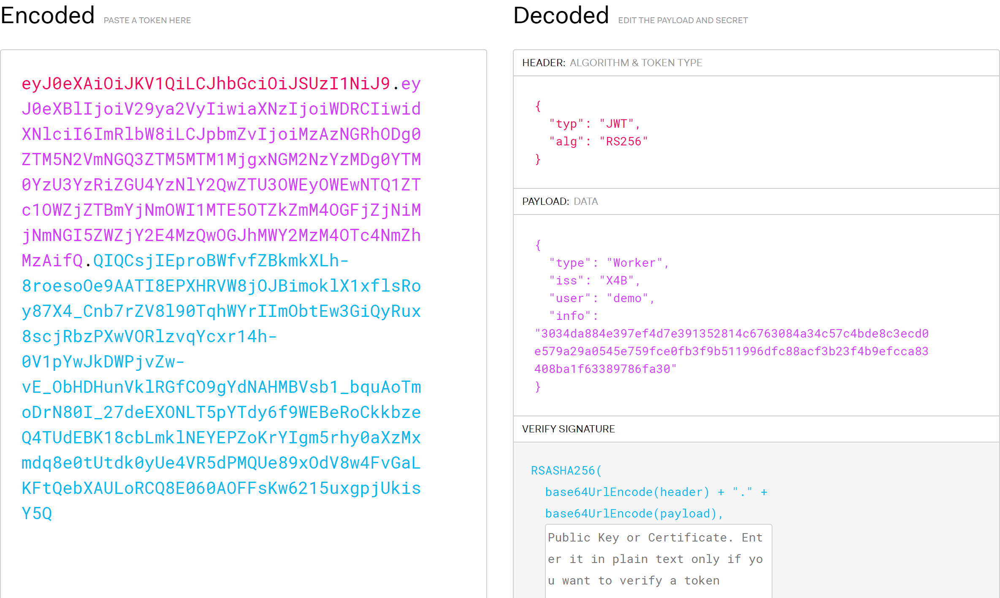
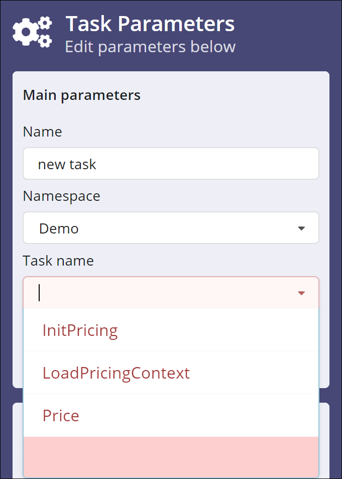
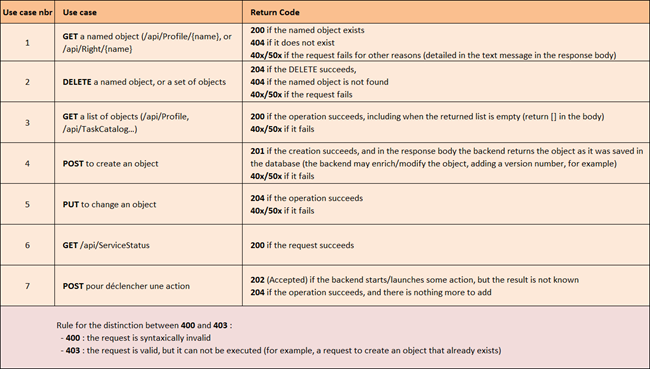

# XC Scenario Developer's Guide

## Table of Contents

* [Introduction](#introduction)
  * [Software Version](#software-version)
  * [Terminology](#terminology)
* [General Description](#general-description)
  * [XC Scenario](#xc-scenario)
  * [Workers and Integration Endpoints](#workers-and-integration-endpoints)
  * [Namespaces](#namespaces)
  * [Functional Architecture Overview](#functional-architecture-overview)
* [REST Endpoints](#rest-endpoints)
  * [Overview](#overview)
  * [Data formats](#data-formats)
  * [Authentication with Scenario](#authentication-with-scenario)
  * [URL Prefix](#url-prefix)
  * [GET /api/ServiceStatus](#get-apiservicestatus)
    * [Description](#description)
    * [Parameters](#parameters)
    * [Return status](#return-status)
    * [Return value](#return-value)
* [Authentication](#authentication)
  * [POST /api/Authentication/User](#post-apiauthenticationUser)
    * [Description](#description-1)
    * [Parameters](#parameters-1)
    * [Return status](#return-status-1)
    * [Return value](#return-value-1)
  * [POST /api/WorkerTokenGeneration](#post-apiworkertokengeneration)
    * [Description](#description-2)
    * [Parameters](#parameters-2)
    * [Return status](#return-status-2)
    * [Return value](#return-value-2)
* [TaskCatalog](#taskcatalog)
  * [POST /api/TaskCatalog](#post-apitaskcatalog)
    * [Description](#description-3)
    * [Parameters](#parameters-3)
    * [Return status](#return-status-3)
    * [Return value](#return-value-3)
  * [GET /api/TaskCatalog](#get-apitaskcatalog)
    * [Description](#description-4)
    * [Parameters](#parameters-4)
    * [Return status](#return-status-4)
    * [Return value](#return-value-4)
* [Polling](#polling)
  * [GET /api/Cancelled](#get-apicancelled)
    * [Description](#description-5)
    * [Parameters](#parameters-5)
    * [Return status](#return-status-5)
    * [Return value](#return-value-5)
  * [GET /api/Peek](#get-apipeek)
    * [Description](#description-6)
    * [Parameters](#parameters-6)
    * [Return status](#return-status-6)
    * [Return value](#return-value-6)
  * [GET /api/Poll](#get-apipoll)
    * [Description](#description-7)
    * [Parameters](#parameters-7)
    * [Return status](#return-status-7)
    * [Return value](#return-value-7)
* [TaskStatus](#taskstatus)
  * [POST /api/TaskStatus](#post-apitaskstatus)
    * [Description](#description-8)
    * [Parameters](#parameters-8)
    * [Return status](#return-status-8)
    * [Return value](#return-value-8)
* [Appendix](#appendix)
  * [HTTP return codes](#http-return-codes)

# Introduction

This document describes the REST API’s that allow a developer to integrate an
external system with XComponent Scenario. The general concepts of the Scenario
design and operational philosophy are described in the Concepts Guide. Some of
them with more relevance to the API are repeated here.

## Software Version

This document corresponds to version 16.5 of the Scenario software. To check
what version of the software you're using, click on the **X4B account** icon on
the right of the X4B banner, at the top of your screen.


## Terminology

The choice of terms used in the Scenario documentation is subject to
discussion. Some terms might be renamed in the future to clarify the
semanctics, and reduce ambiguity.

In particular, the term **workflow** is being phased out, in favor of the term
**scenario**, which better expresses the range and variety of the business
activities that can be modelled with Scenario.

# General Description

## XC Scenario

Scenario is a general-purpose _**scenario**_ builder and execution engine. A
scenario is an organized set of elementary tasks. Scenarios represent different
ways of organizing data, automated processes, or human activities. Scenarios
can represent a _workflow_ that models some business process, for instance; or
a _Gantt diagram_ in a Project Management context; or a _complex calculation_
broken down into smaller parts.

Scenario includes graphical user interfaces (GUI’s) for creating scenario
definitions, as well as running actual instances of these scenarios, monitoring
their progress, and displaying various KPI’s.

Scenario exposes a number of HTTP REST API’s, through which the worker programs
can interact with the server. A thorough description of these API’s is the main
objective of the present document.

## Workers and Integration Endpoints

Scenario does not by itself execute any business tasks. Tasks are executed by
pushing them onto a queue, where external programs called _**workers**_ can
pick them up, and perform the required work.

Supposing that a system called **Pricing** is to be integrated with Scenario,
so that its services can be invoked as part of some business process; then the
Pricing software needs to be modified to implement a Pricing worker, which
means coding API requests on the following endpoints:

* **Task catalog**: the worker pushes _task descriptions_ to the Scenario task
  catalog, thereby making these tasks available to the scenario designer and to
  the execution engine. Each task represents a unit of service that the Pricing
  system exposes to the outside world. This endpoint is detailed in
  the [TaskCatalog](#TaskCatalog) section below.
* **Task Polling**: workers poll this endpoint to retrieve _task instances_ to
  be executed. Tasks are pushed on the queue, by the central engine, whenever a
  scenario is being run, and they are tagged with the namespace associated to
  the task definition (see **catalogTaskDefinitionNamespace**
  in [GET /api/Poll](#GET-apiPoll)). This ensures that every worker only
  retrieves the tasks that are meant for it. This endpoint is detailed in
  the [Polling](#Polling) section below.
* **Status notifications**: workers use this endpoint to notify Scenario of
  their termination, or intermediate progress status. The Status notifications
  endpoint is detailed in the [TaskStatus](#TaskStatus) section below.

The above description makes the assumption that it is possible to modify the
existing software, with the result being that the worker is embedded in the
functional system.

There may be **legacy** systems for which it is not possible (or not desirable,
or too expensive) to change the code. In this case, a _generic worker_ may be
used to interface with Scenario, on one hand, and with a plugin system to
execute scripts (python, shell, …) on the other hand. This way, the scripts can
use the legacy protocols to interact with the legacy systems, and get the tasks
executed.

## Namespaces

A _namespace_ is a free-form string identifier, that is used to group tasks that
are functionally related. A namespace is always specified when a task or task
catalog is created, and a task is always associated with one, and only one,
namespace. A task name must be _unique_ inside its namespace.

A worker polling the task queue must specify the namespace for which it is
retrieving tasks.

Namespaces are a mechanism to avoid name conflicts. Invivoo’s recommendation is
that each team responsible for a given system integrated in Scenario define
their own namespace. Users are responsible for the uniqueness of their
namespace, the server has no way to enforce this.

## Functional Architecture Overview

The following diagram shows Scenario’s functional architecture:


``` diff
- [FIXME: this diagram needs to be updated]
```

Boxes on the right indicate service-oriented business systems, that expose
their functionality as tasks which can be invoked as part of business scenarios
run inside the Scenario.

This architecture implements the Light Orchestration paradigm: it separates the
control flow from the data flow, and it ensures that no data flow ever runs
between Scenario and the functional blocks.

# REST Endpoints

## Overview

All communication with the Scenario server is done through RESTful
interfaces. Some of these interfaces may require authentication and/or
authorization, which are described in the next section.

## Data formats

All data exchanged between a worker program and the Scenario server is in JSON
format. This is a simple, straight-forward, and standard textual representation
of complex data.

One important point to note is that the Scenario expects numerical values to
appear in the JSON body inside double-quotes. While still compatible with JSON
standard, this can appear surprising because JSON allows numerical values
without quotes.

So please be sure to write

``` json
"count": "256"
```

and not 

``` json
"count": 256
```

## Authentication with Scenario

A technical token must be stored by the worker for authentication. That token
must be indicated in the _Authorisation_ header in all the HTTP requests made
to the Scenario RESTful interfaces.

Here is a sample HTTP request to retrieve the list of task descriptions:

``` console
GET /TaskCatalog HTTP/1.1
Host: CommandCenter.com:8099
Authorization: eyJhbGciOiJIU...TJVA95OrM7E20RMHrHDcEfxjoYZgeFONFh7HgQ
```

The technical token is linked to a technical user account. It can be acquired
via a Post request to the Authentication REST endpoint. The body of that
request contains an object holding the user credentials.

Request URL: /authenticationservice/workertokengeneration

Object to include in the body:

``` json
{
"username": "Bob",
"password": "Bobspassword"
}
```

Note that tokens for human users have an **expiration date** set by your
administrator, whereas worker tokens never expire (to avoid operational
incidents, where a critical component fails at the worst possible moment, for
lack of a valid token).

**Note:** the distribution of worker tokens is dependent on your organization’s
administrative policies. Please contact your IT administrator if you cannot
request a token.

## URL Prefix

The general format of the URLs for the REST endpoints is

``` console
${BASE_URL}/${endpointname}/${operation}
```

The BASE_URL points to your Scenario server. For example, Invivoo has an online Scenario instance that can be found at https://scenario.xcomponent.com. You should replace this with the appropriate value at your site.

The `endpointname` is 

| Service | Endpoint name |
| --- | --- |
| AdministrationService | administration |
| Authentication API | authentication |
| AuthorizationService | authorization |
| MonitoringService | monitoring |
| PollingService | polling |
| TaskCatalogService | taskcatalog |
| TaskStatusService | taskstatus |
| UploadService | upload |
| WorkflowService | workflows |

Note the 's' in "workflows".

The next section details the Authentication service endpoint, and its usage for
both human and program users.

## GET /api/ServiceStatus

### Description

The following sections describe some of the service endpoints exposed by the Koordinator server. All of these services share one common API call, called /api/ServiceStatus, that can be used to test if an endpoint is up and running

### Parameters

None.

### Return status

The following HTTP status codes may be returned :

| HTTP Code | Description |
| --- | --- |
| 204 | Service is up and running |

### Return value

None.

# Authentication

## POST /api/Authentication/User

### Description

This operation sends some user’s credentials to the Koordinator server, and
returns a JWT token that can be used to authentify the user in later API
requests. It is meant for use by the Koordinator UI (webapp).

### Parameters

Body parameter: **CredentialsInfo**  (JSON object)

### Return status

The following HTTP status codes may be returned :

| HTTP Code | Description |
| --- | --- |
| 200 | Ok |
| 401 | User credentials are wrong. |

### Return value

If the operation succeeds (status 200), it returns a **TokenInfo** object,
where the **value** property holds the JWT token (JSON Web Token, based on RFC
7519). The token embeds information such as the user’s login and password, the
set of rights associated to his role, and an expiration date.

Please visit [https://jwt.io](https://jwt.io) for more information on JWT
tokens, including a web form to paste in a token and have it decoded. Example :



## POST /api/WorkerTokenGeneration

### Description

This operation is very similar to the previous one: it sends some user’s
credentials to the Scenario server, and returns a JWT token that is meant to be
used by worker programs, because it never expires.

### Parameters

Body parameter: **CredentialsInfo** (JSON object)

Note: if the credentials are invalid (unknown user, or incorrect password), the
request will still return a successful status (200). Only when an attempt is
made to call one of the Scenario’s API’s will the token be checked, and
rejected with the message **Forbidden : Token not authorized** and status
**403**.

### Return status

The following HTTP status codes may be returned :

| HTTP Code | Description |
| --- | --- |
| 200 | Ok |
| 500 | Error while generating token. |

### Return value

If the operation succeeds (status 200), it returns a **TokenInfo** object,
where the **value** property holds the JWT token.

# TaskCatalog

| Panel | Description |
| --- | --- |
|  | This endpoint lets an external system push a _catalog of tasks_ to the Scenario server. These tasks correspond to some functionality that is exposed by the external system, so that other users and systems may use it, through scenarios developed in the Scenario.</br></br>The **task catalog** appears on the graphical user interface, in the scenario designer tool, so that an end user can implement business scenarios that use these tasks.</br></br>In the image to the left, the user has selected a [namespace](#Namespaces) called **Demo**, that includes tasks called :</br>* InitPricing</br>* LoadPricingContext</br>* Price</br></br>These tasks have been pushed by a worker program using the API call below. |

## POST /api/TaskCatalog

### Description

This operation sends a set of task definitions for the Scenario server to
add into its global task catalog.

The **CatalogUpdate** object holds an array of **CatalogTaskDefinition**
objects. A task definition has several properties such as a name, a displayName
for use in the UI, A version number, etc.

It may optionally include input and output parameters. If specified, parameters
are described in a **CatalogParameterType** object. This will identify the
parameter type (string, integer, …) and eventually a default value.

### Parameters

Body parameter: **CatalogUpdate** (JSON object)

### Return status

The following HTTP status codes may be returned :

| HTTP Code | Description |
| --- | --- |
| 201 | Updates sent, tasks created |
| 400 | Empty or invalid update |
| 401 | Token not authenticated or authorization header missing |
| 403 | Token not authorized |
| 500 | An error occurred while updating catalog |

### Return value

None.

## GET /api/TaskCatalog

### Description

This operation sends a request for the task catalog from the Scenario
server. By default, all existing tasks will be returned. It is possible to
limit the number of tasks returned by specifying a few query parameters, in
which case only the tasks that match the given parameters will be returned.

### Parameters

Query parameters:

* **taskName** (string)
* **version** (integer)
* **namespace** (string)
* **getLastTaskVersion** (boolean)

### Return status

The following HTTP status codes may be returned :

| HTTP Code | Description |
| --- | --- |
| 200 | Ok |
| 401 | Token not authenticated or authorization header missing |
| 403 | Token not authorized |

### Return value

If the operation succeeds (status 200), it returns an array of
**CatalogTaskDefinition** objects (not a **CatalogUpdate** object).

# Polling

## GET /api/Cancelled

### Description

A task that has been started by the Scenario engine (modelled by a
**TaskInstance** object) may be _cancelled_ by the server if it fails to
complete within a specified timeframe (timeout). Worker programs are not
notified of this, because the Scenario, given its’ Light Orchestration
architectural paradigm, never pushes out information directly to any other
program.

This operation queries the server regarding the cancellation status of the task
instance specified in the query parameters.

### Parameters

Query parameters:

* **catalogTaskDefinitionNamespace** (string)
* **taskInstanceId** (string)

### Return status

The following HTTP status codes may be returned :

| HTTP Code | Description |
| --- | --- |
| 200 | Ok |
| 401 | Token not authenticated or authorization header missing |
| 403 | Token not authorized |

### Return value

The returned object has a single boolean property **isCancelled**, which is
true if the server has cancelled this task instance.

## GET /api/Peek

### Description

When scenarios are started, each task that becomes ready to be executed is
pushed onto a **task queue** by the Scenario engine. All the workers share a
single task queue. This operation retrieves an array with all the available
tasks (eventually filtered by namespace). This operation is read-only, it does
not remove tasks from the queue (unlike `/api/Poll` in the next section).

This is an information-only operation. Workers must _not_ initiate any actual
work on the task instances received.

### Parameters

Query parameters:

-	**catalogTaskDefinitionNamespace** (string)
-	**workspaces** (string) [NOT IMPLEMENTED YET]

### Return status

The following HTTP status codes may be returned :

| HTTP Code | Description |
| --- | --- |
| 200 | Ok |
| 401 | Token not authenticated or authorization header missing |
| 403 | Token not authorized |

### Return value

An array of TaskInstance objects. These objects have references to the scenario instances that are requesting the execution of these tasks, to the original task definitions in the catalog, to the user running the scenario, etc.

## GET /api/Poll

### Description

This operation is similar to the previous one, in the sense that it queries the
task queue. But unlike the Peek operation, the **Poll** operation retrieves a
_single_ task instance, it removes that instance from the task queue, and it
updates the task’s internal status (visible on the Cockpit) from **Waiting** to
**Running**.

Worker programs that receive a task instance from a Poll request _must_ perform
the work associated to the task. The task instance includes a reference to the
original CatalogTaskDefinition. It is the worker’s responsibility to match -
through the CatalogTaskDefinition - the task instances received with some
actual business function to be executed.

### Parameters

Query parameters:

-	**catalogTaskDefinitionNamespace** (string)
-	**workerId** (string)
-	**workspaces** (string) [NOT IMPLEMENTED YET]

The **workerId** parameter is a free-form identifier that a worker assigns to
itself, and that gets displayed in the Scenario cockpit. Worker implementors
are invited to carefully manage the worker ids to ensure that meaningful and
useful information is presented to the end user.

### Return status

The following HTTP status codes may be returned :

| HTTP Code | Description |
| --- | --- |
| 200 | Ok |
| 204 | No task available |
| 401 | Token not authenticated or authorization header missing |
| 403 | Token not authorized |

### Return value

If the operation succeeds (status 200), it returns a single **TaskInstance**
object. The **inputData** property inside the TaskInstance has the actual input
values to be used in the task execution.

# TaskStatus

## POST /api/TaskStatus

### Description

This operation allows a worker to send information to the Scenario server.

It is the worker’s responsibility to provide updates on the execution of its
tasks. At the very least, a worker must post a TaskStatusEvent with
status=**Completed** when the task is finished. Otherwise, Scenario will
eventually mark the task as “in error” following a timeout.

If a task takes a significant amount of time to execute, worker implementors
should post **TaskStatusEvents** with status=**In Progress**, and a message
field describing the state of the task execution (ideally with a completion
percentage if possible).

When a task completes, workers should fill the **outputValues** properties 
of the **TaskStatusEvent**.

### Parameters

Body parameter: **TaskStatusEvent** (JSON object)

### Return status

The following HTTP status codes may be returned :

| HTTP Code | Description |
| --- | --- |
| 200 | Update sent |
| 204 | No Content |
| 400 | No update sent |
| 401 | Token not authenticated or authorization header missing |
| 403 | Token not authorized |

### Return value

None.

# Appendix

## HTTP return codes

The following table describes a few use cases that were used to define the
general rules for determining the expected return code .


