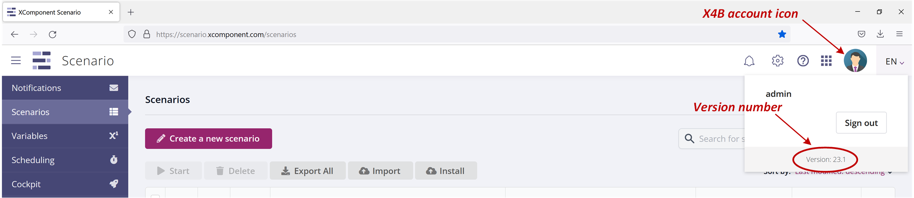
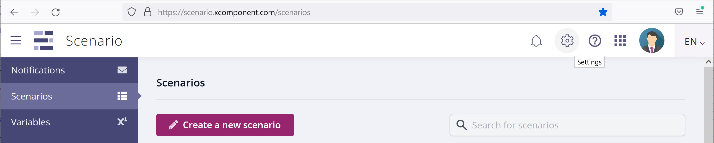
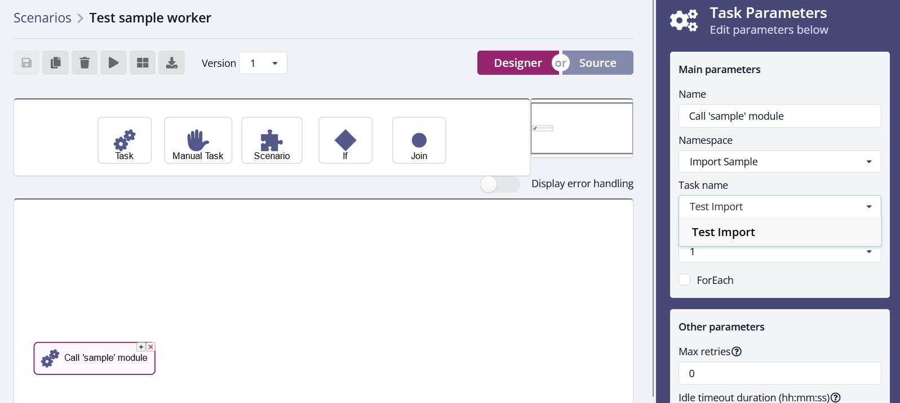
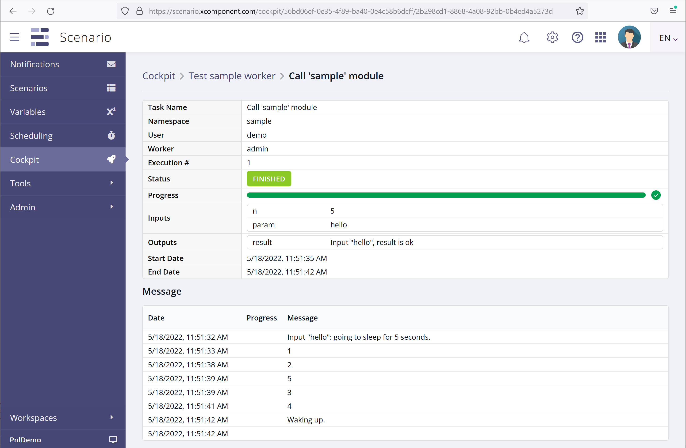
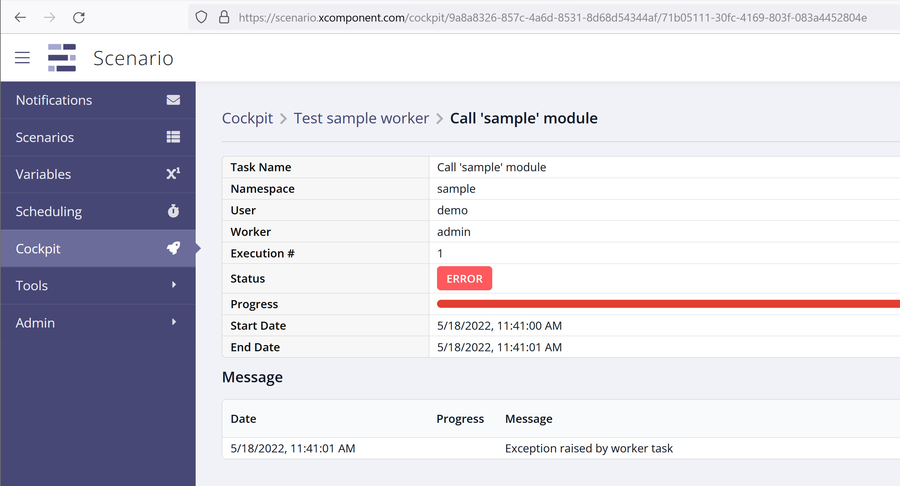

# XC Scenario python worker

## Table of Contents

* [XC Scenario python worker](#XC-Scenario-python-worker)
  * [Table of Contents](#Table-of-Contents)
  * [Introduction](#Introduction)
  * [Software version](#Software-version)
  * [Software architecture](#Software-architecture)
  * [The worker.py script](#The-worker.py-script)
  * [The user module](#The-user-module)
    * [simple](#simple)
    * [double](#double)
    * [reporting_task](#reporting_task)
    * [error_placeholder](#error_placeholder)
    * [zero_division](#zero_division)
  * [Running the worker directly](#Running-the-worker-directly)
    * [Obtaining an API key](#Obtaining-an-API-key)
    * [Setting the environment variables](#Setting-the-environment-variables)
    * [Launching the worker](#Launching-the-worker)
  * [Running the worker inside a container](#Running-the-worker-inside-a-container)
* [Testing the worker](#Testing-the-worker)

## Introduction

This document describes an example implementation of an XC Scenario worker in
python. A **worker** in this context is some program which has the capability
to execute tasks that are orchestrated by XC Scenario: tasks that are ready to
be executed are pushed onto a queue; the worker program polls the queue for new
tasks, extracts them from the queue, and executes them.

For more background information on workers and the worker API, see 

* [XC Scenario Concepts](https://xcomponent.github.io/scenario-documentation/concepts/)
* [XC Scenario Developer’s Guide](https://xcomponent.github.io/scenario-documentation/dev-guide/)

## Software version

This document corresponds to version 23.1 of the Scenario software. To check
what version of the software you're using, click on the **X4B account** icon on
the right of the X4B banner, at the top of your screen.



## Software architecture

The python worker implementation described here separates the code in two
parts:

* a **generic** part (in a script called `worker.py`), that handles all the
common functionality such as the interactions with XC Scenario, polling for
tasks, auto-completing tasks, etc; this part can be reused in each worker.

* a **specific** part, which includes the actual code for the tasks. The name
  is typically descriptive of the kind of functions the module defines. The
  code can perform some kind of processing directly, or it can invoke some
  external system or API in order to leverage existing functionality. 

This architecture encourages developers to group together (in the same specific
module) functions that have some logical relationship with each other, and
deploy one worker instance for each functional area (instead of having a
single, huge worker process with all the tasks/functions).

## The worker.py script

The `worker.py` script's main job is to poll for tasks and execute them. It
gets a module name from the command line, and imports it, so that the function
code defined in that module can be made available; it publishes a **Task
Catalog** so that XC Scenario can display the list of tasks, with each function
from the module becoming a possible task.

The script also implements a notification mechanism to allow user functions to
post task statuses.

The code for the example `worker.py` script provided in this repository has
been extensively commented, so don't hesitate to read the source code for more
details on what the code does.

## The user module

The user module is where the task functionality is actually implemented in
python code. There are a few requirements for this user code, to ensure that it
communicates properly with the worker script, and hence, with XC Scenario:

* the module is assumed to contain a list of toplevel functions, where each
function is meant to implement a XC Scenario task.

* the first parameter of each function is an object reference, on which a
`notify` method can be invoked to send errors or progress reports back to XC
Scenario

* other parameters can be included as required by the function's needs

* each function must return a dictionary of simple types

* the module must include a `task_definitions()` function, which has no
  arguments and returns an array. Each element of the array is a python version
  of the CatalogTaskDefinition JSON object defined in the REST API definition,
  see https://scenario.xcomponent.com/taskcatalog/swagger/ui/index, POST
  /api/catalog-task-definitions/{namespace} operation. Each task definition
  must exactly match the _signature_ of a given function in the module.

An example module, called `sample.py`, is included in this repository, which
illustrates all the constraints described here. As with the worker.py script,
the sample.py module has been extensively commented for learning purposes.

The module includes five functions, described below, to illustrate different
possible behaviours and statuses.

### simple

This function returns a message echoing the input parameter. 

### double

This function simulates some basic processing on the inputs, returning modified
values. It also illustrates some basic type checking done on the inputs, with
an Error status being reported to XC Scenario if an input parameter has an
incorrectly typed value.

### reporting_task

This is a more sophisticated example, where an input parameter specifies a
number of seconds, so that we can have a long-running function, and the code
periodically posts a notification, indicating the progress percentage. The
progress messages are displayed in the XC Scenario cockpit, on the running
task's page.

### error_placeholder

This function unconditionally generates an error status.

### zero_division

This function forces a python exception in its code, to illustrate how the
`worker.py` script traps any exception happening in user code, and gracefully
generates an XC Scenario error status.

## Running the worker directly

This example worker program can be run directly, or inside a container, to
interact with an existing XC Scenario platform. First, you will need to obtain
the URL of the target platform, and an API key. If your organization does not
have a dedicated X4B platform with Scenario, you can sign in to Invivoo's
public platform at https://x4b.xcomponent.com/.

### Obtaining an API key

After you've logged onto the platform, click on the Settings icon (the gear
icon) in the top banner:



On the Settings screen, you can assign a name to your key, choose an expiry
date, and generate the key. Copy the text of the key (click on `Copy to
clipboard`) so you can assign it to the environment variable (see next section).


### Setting the environment variables

The worker program requires two environment variables to function properly:

| Variable name | Contents |
| --- | --- |
| XC_SCENARIO_SERVER | URL of XC Scenario server, e.g. http://scenario.xcomponent.com |
| XC_SCENARIO_APIKEY | Value of the API key obtained from the Settings page |

Make sure the variables are set up in the environment before moving on to the
next step (eventually restart your shell or command line tool).

### Launching the worker

If you have cloned this repository into a local directory, you can just change
into that directory and run the program directly :

``` console
py worker.py sample
```

Note that the argument must be the module's name (without the '.py' extension),
not the filename.

Normally you should see the traces from the worker:

``` console
2022-05-18 15:18:26 worker: sample: task queue is empty
2022-05-18 15:18:28 worker: sample: task queue is empty
2022-05-18 15:18:30 worker: sample: task queue is empty
```

## Running the worker inside a container

The repository includes an example `dockerfile`, which can be used to build a
docker image with the worker code and an associated user module. The image can
be built with the following command:

``` console
docker build -t <name>/<tag> .
```

substituting `<name>` and `<tag>` with your own values. This assumes the
command is being run in the same directory where the repository was cloned, so
that the build context is the current directory, indicated as `.` in the above
command.

The image can also be pushed onto a registry such
as [DockerHub](https://hub.docker.com):

``` console
docker push -t <name>/<tag>
```

Finally, the image can be run inside a docker container by running the
following command:

```console
docker run -dt \
	-e XC_SCENARIO_APIKEY=<api_key> \
	-e XC_SCENARIO_SERVER=http://scenario.xcomponent.com \
	<name>/<tag>
```

The API key must be obtained from the XC Scenario server, as described
in [Obtaining an API key](#Obtaining-an-API-key) above.

The trace messages from the worker can be seen using the `docker logs` command.

# Testing the worker

When the worker program is launched, it publishes a catalog of tasks which you
can see when you create a task in the XC Scenario designer:



If you select one of the tasks, say `reporting_task` for example, you can enter
the values for the input parameter, save and run your scenario. In the Cockpit
screen, if you navigate to this scenario and task's page, you will see the
messages sent by the user code:



Alternatively, if you select the `zero_division` sample task, you will see an
Error status and a message indicating that an exception was raised in the user
code.



# Final note

The implementation provided in this repository is just an example. The program
could be coded differently, the only requirements being to:
* publish a task catalog
* poll the task queue for available tasks
* publish task statuses.

Also note that the example implementation is _single-threaded_, so other tasks
will be kept waiting in the queue while a given task is executing, which could
negatively affect performance.

While it is possible to code a multi-threaded version of the worker, a simpler
solution is to deploy the worker in a _container_, as described
in
[Running the worker inside a container](#Running-the-worker-inside-a-container)
above, and rely on container systems such as **kubernetes** to replicate many
instances of the worker, giving you the full benefits of horizontal scaling
while keeping the code as simple as possible.


