# XC Scenario User Guide

## Table of Contents

* [Introduction](#introduction)
  * [Software Version](#software-version)
* [General Overview](#general-overview)
  * [Introduction](#introduction-1)
  * [Main sections](#main-sections)
* [Logging into the system](#logging-into-the-system)
* [Scenarios](#scenarios)
  * [List of scenarios](#list-of-scenarios)
  * [Scenario creation page](#scenario-creation-page)
    * [Overview](#overview)
    * [Scenario-level input parameters](#scenario-level-input-parameters)
    * [Specifying scenario inputs](#specifying-scenario-inputs)
    * [Adding tasks to the scenario](#adding-tasks-to-the-scenario)
  * [Dynamic input values](#dynamic-input-values)
    * [Overview](#overview-1)
    * [Linking to task parameters](#linking-to-task-parameters)
    * [Linking to scenario parameters](#linking-to-scenario-parameters)
* [Cockpit](#cockpit)
  * [Toplevel view](#toplevel-view)
  * [Scenario-level view](#scenario-level-view)
  * [Task-level view](#task-level-view)

# Introduction

This document is meant to be a comprehensive guide to Invivoo’s **XC Scenario**
product, from an _end user_’s point of view. As such, it describes the user
interfaces for designing, editing, running, and monitoring scenarios.

The general concepts of Scenario are described in the Scenario Concepts
Guide. If you are not familiar with the notions of scenarios/workflows, tasks,
etc, we recommend that you read that guide first, and then come back to this
one.

## Software Version

This document corresponds to version 16.5 of the Scenario software. To check
what version of the software you're using, click on the **X4B account** icon on
the right of the X4B banner, at the top of your screen.

# General Overview

## Introduction

This document gives a full and comprehensive description of the **Scenario UI**
(User Interface) and its usage.

The Scenario user interface is a web application, or so-called thin
client. It requires no installation on the user’s computer, and can be accessed
with a simple web browser, by pointing it to the URL of Scenario. The
exact URL to use is dependent on the installation and setup that was done in
your company, by your IT staff. If you don’t know this URL, please contact your
IT administrator.

## Main sections

The web application has several pages, which can be accessed from the menu
panel on the left of each web page, by clicking on the page title :

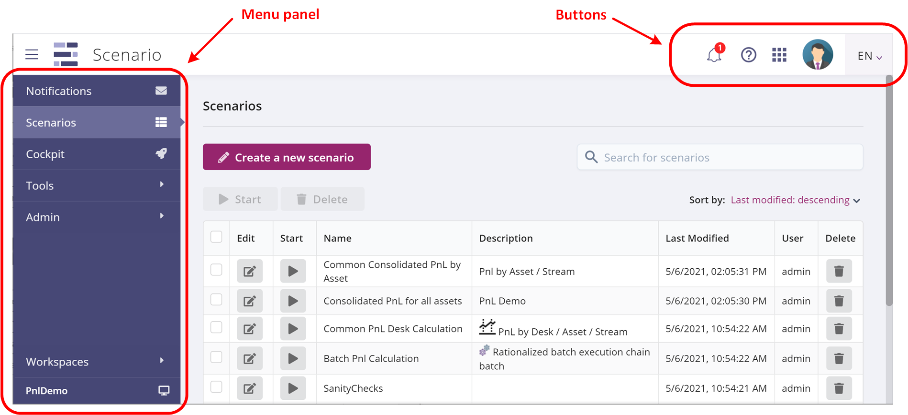

Contents of each page (detailed in the following sections):

* **Notifications**: view the list of pending notifications from manual tasks
* **Scenarios**: view the list of existing scenarios, edit a scenario, launch a scenario run
* **Cockpit**: real-time view of running scenarios and tasks
* **Tools**: API token generation, scenario and task catalog import/export
* **Admin**: manage users, roles, rights, etc. Restricted to administrative users.
* 
* **Workspaces**: dropdown menu allowing a user to choose which workspace to work in.

Also present to the right of the top-level ribbon are a few buttons:

| Icon | Description |
| --- | --- |
|  | Link to manual tasks' Notifications page. |
|  | Links for help and support, email and Slack channel. |
|  | Links to other X4B applications, such as AppControl and Chatbot Fabric. |
|  | Currently logged-in user account information, and software version. |
| 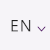 | Choice of UI language, currently English and French are supported. |

# Logging into the system

When you type in the Scenario address in your browser, you are brought to
the application’s login prompt :

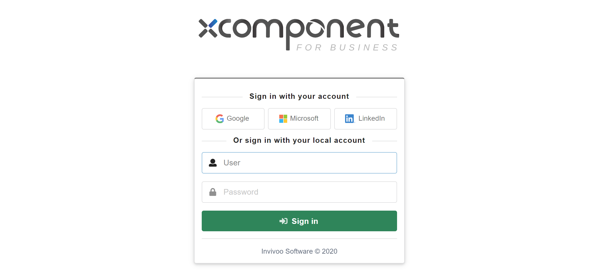

Two modes are available to log in to an account. You can either use a **social
provider**, or enter the user's credentials to connect with a **local
account**:

* If you have an account with a _social provider_ and wish to use that identity
to log into Scenario, press the button for your provider. Currently Google,
Microsoft, and LinkedIn are supported.

* Entering user credentials is the suitable option if you have a _local
Scenario account_. It's an account stored in Scenario database. Simply type
your credentials and click on the **Sign In** button.

# Scenarios

## List of scenarios

After logging into Scenario, the user is presented with the following screen :

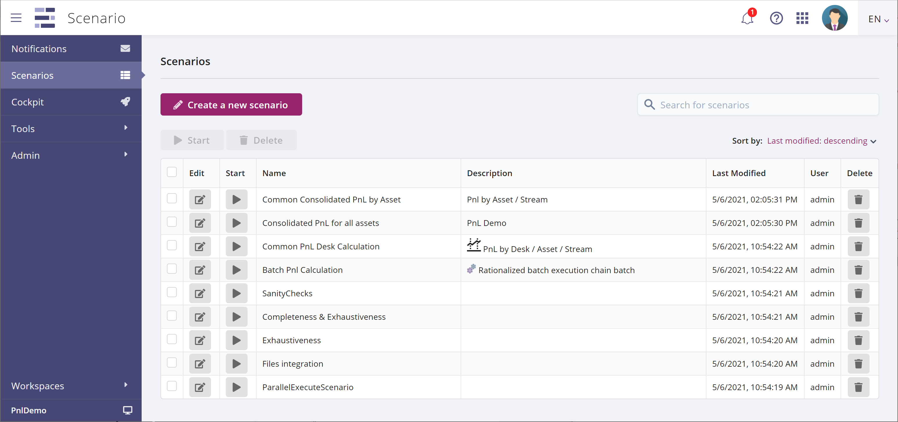

On the left_hand side of the window, a menu panel gives access to the various
screens, and other application functionality, as described in
[Main sections](#Main-sections) above. On login, the Scenarios page is the
current one.

The **Create a new scenario** button lets you create a new scenario definition,
as detailed in [Scenario creation page](#Scenario-creation-page) below.

The **Search** text entry box lets you search for a given scenario in the set
of all existing scenarios.

The main body of the page shows a **list of scenario definitions**, where each
row describes one scenario, with several columns either displaying information,
or holding some buttons to act on the scenario. Here are the details for each
column:

| Column | Icon | Description |
| --- | --- | --- |
| **Edit** | 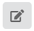 | Edit a scenario definition |
| **Start** |  | Launch a scenario execution |
| **Name** |  | Scenario name |
| **Description** |  | A brief, one-line description of the scenario |
| **Last Modified** |  | Time of last modification |
| **User** |  | Name of the user who created the scenario definition |
| **Delete** | 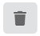 | Launch a scenario execution |

## Scenario creation page

This page is where the design of scenarios takes place. A set of graphical
commands lets the user build the graphs that organize the tasks to be executed
in each scenario, and a tool panel on the right allows parameters, inputs and
outputs to be defined, and also gives access to the task catalog.

### Overview

This image explains the various components of the scenario design page, as seen
when a scenario is first created:

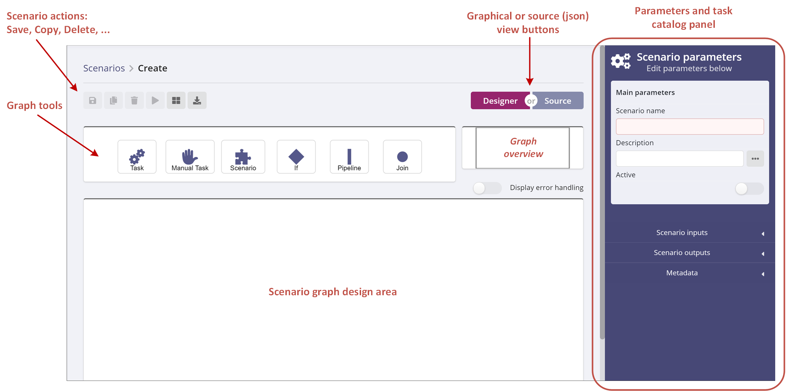

The larger white area is where the scenario graph will be displayed and
edited. The graph is created by dragging and dropping icons from the **graph
tools** toolbox. As it grows, and it no longer fits in the window, the **graph
overview** will let the user navigate the entire graph, and change the subset
that is displayed.

The **scenario action** buttons act on the entire scenario : save it, make a
copy, delete, cancel current edits, launch an execution run.

The **graph or source view** buttons give the user access to the underlying
JSON representation of a scenario, with the possibility of creating a scenario
by dragging a file onto this window.

At any given moment, this screen is in one of two states : **scenario-level**,
or **task level**, and the panel on the right switches to display the relevant
fields. Initially, the page is in scenario mode; clicking on a task switches to
task mode; clicking on the white background switches back to scenario mode.

### Scenario-level input parameters

When in scenario mode, the panel on the right displays the following
scenario-level parameters and controls :

| Panel | Description |
| --- | --- |
| 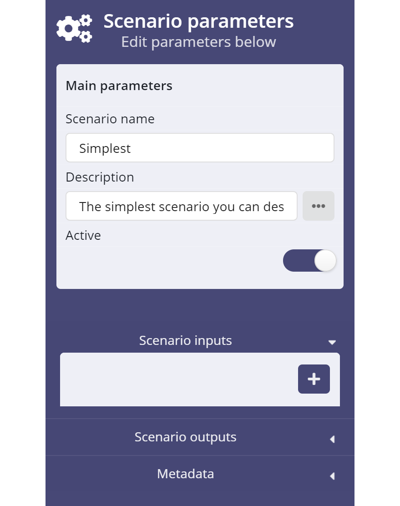 | **Scenario name**: a short text identifying the scenario  **Description**: A one-line description of the scenario, that will be used in the list of scenarios (see [List of scenarios](#List-of-scenarios) above).  **Active** button: this button controls whether the scenario can be started or not, only scenarios marked on can be started. Initially, the button is off when a new scenario is created. A future version may require a specific right to turn a draft scenario into a live one.  **Scenario inputs**: press the blue ‘+’ button to add inputs to the scenario. The user will be prompted for these inputs when the scenario is started. Scenario inputs are detailed in the next section.  **Metadata**: information about the scenario itself, such as date and user of scenario creation and modification, and scenario version number.  |

### Specifying scenario inputs

Scenarios can have inputs defined for them, so that a user can specify a set of
_parameters_ for each scenario run. The values entered at run time remain
constant for the entire duration of the run. Scenario lets you connect scenario
inputs to task inputs (described
in [Linking to scenario parameters](#Linking-to-scenario-parameters) below), so
that the user’s parameters can flow down to the level of each individual task.

| Panel | Description |
| --- | --- |
| 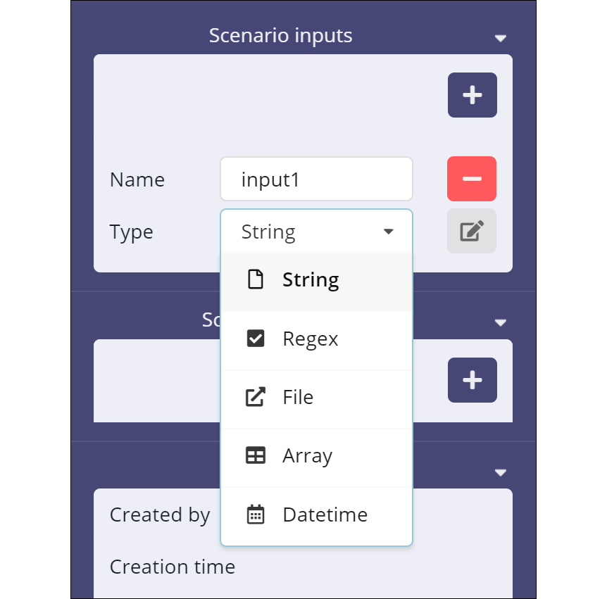 | Press the blue ‘+’ button to start specifying inputs for the scenario. Scenario displays two text boxes labelled `Name` and `Type`.   Clicking inside the Type box opens a dropdown menu from which you can pick your type:  **String**: simple free-form value, with an eventual default value  **Regex**: string value constrained by a regular expression  **File**: Scenario will prompt for it at run time (there is no possible default value).  **Array**: TBC.  **Datetime**: TBC.   |

The edit button  lets the user enter a _default
value_, for string inputs, or the _regular expression_ and _default value_ to
be used with regex inputs.

### Adding tasks to the scenario

You can easily add a task to a scenario by dragging the Task icon into the
scenario graph design area, as shown here:

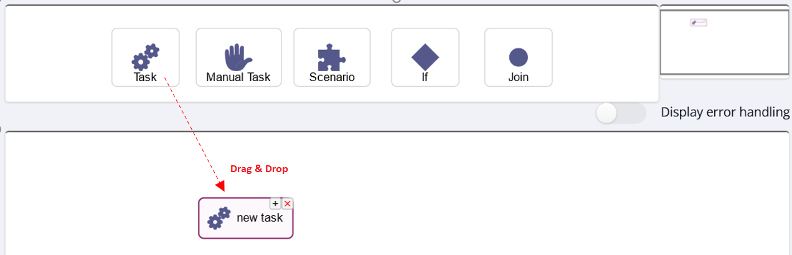

Other icons allow a user to define _pipelines_ of tasks, and to _join_ several
tasks in a synchonization tasks. These notions are explained in the Scenario
Concepts Guide, and the practical aspects are detailed in the next sections.

When the user clicks on the newly added task, the right-side panel changes from
displaying scenario parameters to displaying the following task-level
parameters:

| Panel | Description |
| --- | --- |
| 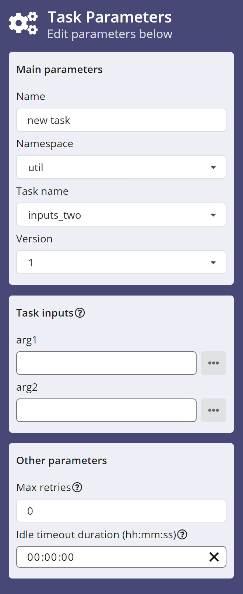 | **Name**: A short description of the task, that will be displayed in the task’s icon in the scenario design area.  **Namespace**: a drop-down menu with a list of _namespaces_. The notion of namespace is central to the functional architecture of Scenario, it groups related tasks into a catalog. Namespaces are explained in greater detail in the Scenario Concepts Guide  **Task name**: this drop-down menu is linked to the previous one. For each namespace set in the previous control, this menu lists all the tasks that are defined as part of that namespace. Collectively these two controls define the catalog of business tasks that are available to the user for the designing of scenarios.  **Version**: Tasks are versioned, and the user can use this drop-down list to choose a specific version of the task.  **Task inputs**: tasks may have input parameters in their definition. When this is the case, the panel displays a control with the input name, a text box to enter a value, and a button to access other, alternative means to provide a value (see next section). In the example shown here, task `inputs_two` has two inputs called `arg1` and `arg2`.  **Max retries**: an integer value, that specifies how many times Scenario will re-run a task that ended with an error status. |

## Dynamic input values

### Overview

In the simplest case, the user enters a value for `arg1` or `arg2` in the text
box above. The value will appear in the input data, when the task is run,
making it available for the processing that is performed by the task. But it
will be a constant value, used for every run of this scenario. While this may
be sufficient for some needs, in most cases users want dynamic values that can
change with each run.

To specify alternative sources of data for a given input, click the button to
the right labelled 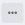 to display the input
parameter editor.

The **input parameter editor** has a text box where the user may type a string
value. More interestingly, it has a drop-down menu to let the user specify a
data source, and pinpoint the actual datum to be used. When the user presses
the arrow below **Insert a variable**, a drop-down menu is displayed:

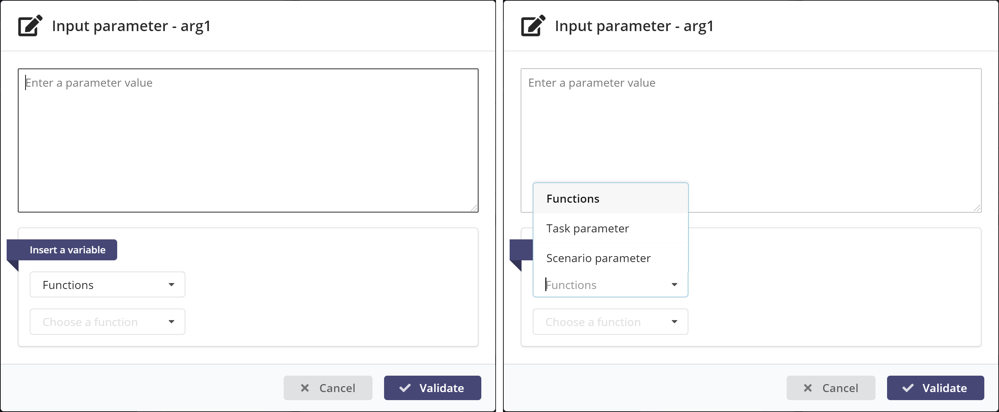

The following data sources are available:

* **Task parameters**: use this data source to access input or output
  parameters of _other_ tasks. This will typically be used to route a
  calculation result, from an output of the task that calculated it, to an
  input of a task that needs to use the result in its own processing.

* **Scenario parameters**: use this data source to access the input parameters
  specified for the _scenario_ itself. These values are entered by the user
  when the scenario is launched, so the values are specific to each run. For
  example, a scenario may perform a market risk calculation, such as a VaR, for
  a given day ; the scenario would then have an input parameter called
  As-of-date, and the calculation tasks would access that value by referring to
  the as-of parameter from one of their own inputs.

* **Functions**: helper functions can be used to let a user build a complex
  string value, by replacing the specific syntax of function references with
  the actual value calculated by the function. Currently three functions are
  available:
  * **New GUID**: generate a Globally Unique ID
  * **Datetime**: replace with the current date
  * **Scenario Base Url**: the base URL for this Scenario server

### Linking to task parameters

Selecting the **Task parameter** item will display the list of tasks currently
defined in the scenario. Assuming the user has created two tasks called **A**
and **B** (see [Adding tasks to the scenario](#Adding-tasks-to-the-scenario)),
this is what will be displayed:

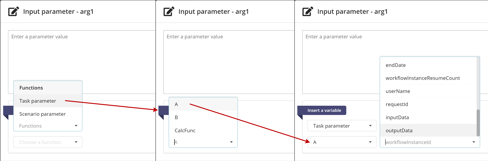

For any given task, the inputs or outputs may be specified as the desired
source. If we pick the **outputData**, we are presented with the list of
outputs of this task, in this case a field called **msg**:

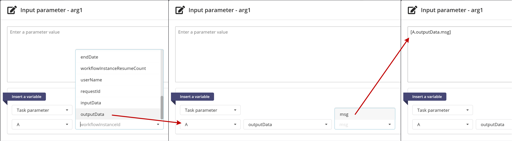

When the user selects the field, Scenario generates an expression between
square brackets that identifies the **source** of the data that will be fed
into this input value. This is also called _templating_, and is explained with
the following image:

(**Black font** represents constant parts of the expression, **blue font** is used for variable parts)

### Linking to scenario parameters

Selecting the **Scenario parameter** item will display the list of input data
fields defined for the scenario. Assuming the user has created two
scenario-level inputs called `nbr_records` and `text`
(see [Scenario-level input parameters](#Scenario-level-input-parameters)), this
is what will be displayed:

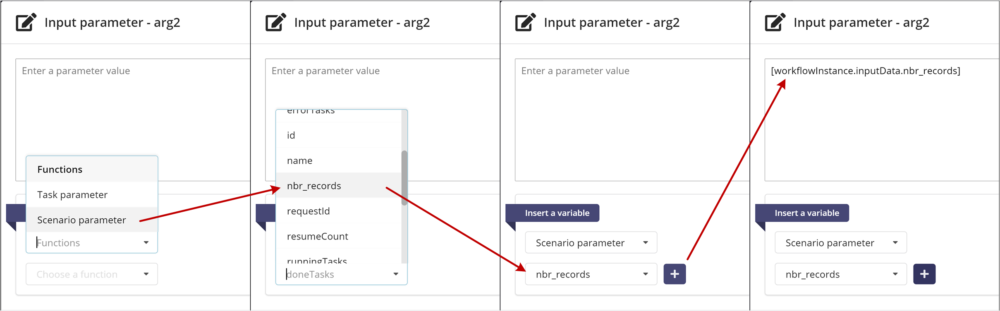

When the user clicks the  button, Scenario
generates a templating expression that identifies the source of the data that
will be fed into this input value:

# Cockpit

The Cockpit page is where you can follow the Scenario activity in real-time,
checking the entire set running of currently running scenarios, zooming in to a
specific scenario, or even to a specific task.

## Toplevel view

When you first click on the Cockpit button in the page header, Scenario
presents the toplevel view, which lists the current history in terms of
scenario instances, both running and terminated. In the image below, you can
see that there are six scenario instances running; there are also a number of
instances that have finished their run, either normally or in error.

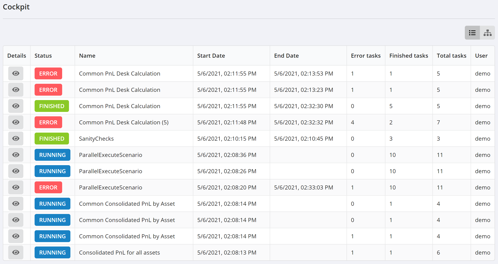

The main body of the page shows a list of **scenario instances**, where each
row describes one scenario instance, with several columns displaying
information about the instance. Here are the details for each column:

| Column | Description |
| --- | --- |
| **Details** | Zoom into the scenario description |
| **Status** | Current status of this scenario run (Running, Finished, Error, etc) |
| **Name** | Scenario definiton name |
| **Start/End Date** | Date and time when the scenario instance started (or ended) running |
| **Tasks** | Statistics on task executions |
| **User** | The username of the person that started the scenario run |

The ‘eye’ icon  in the **Details** column lets
you zoom into that scenario for more details, described below.

## Scenario-level view

Clicking on the ‘eye’ icon displays a view of the scenario instance, showing a
graphical representation of the scenario definition (as a DAG, directed acyclic
graph), as well as information about the current run.

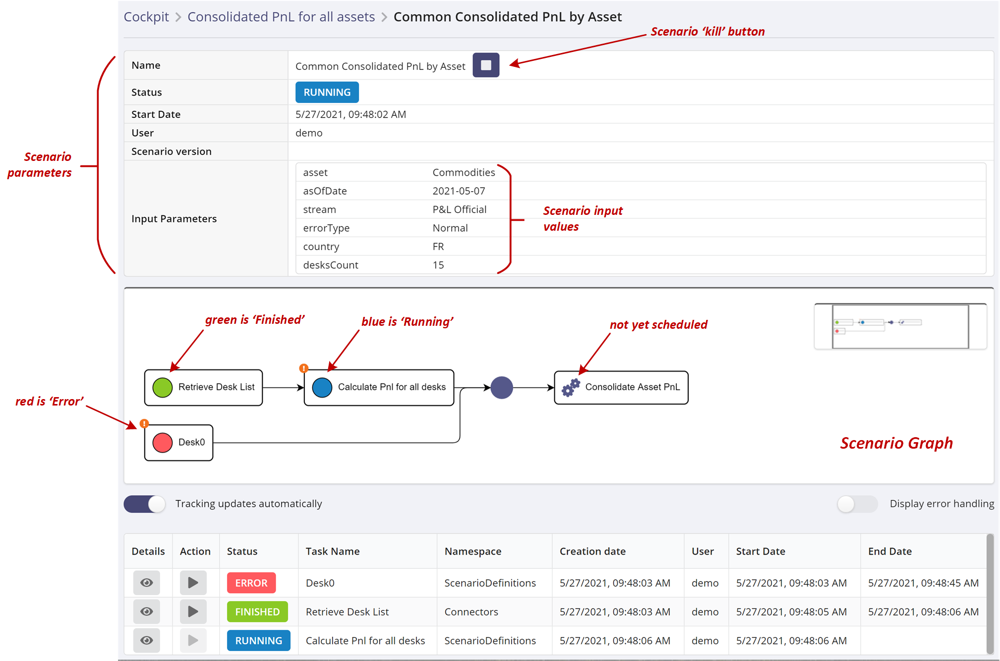

The view has three main parts:

* **top tier**: shows scenario data, including launch-time parameters with
  their values, and a scenario kill button to stop the current run.
* **middle tier**: the dynamic, graphical view of the running scenario. Task
  are color-coded according to their current status, updated in real-time so
  it’s easy to see the progression of this run.
* **lower tier**: an array of tasks, displaying tasks from this scenario that
  have run or are still running, and updating in real-time. For each task, the
  following elements are available :

| Column | Description |
| --- | --- |
| **Details** | Zoom into the task description |
| **Action** | Re-run this task |
| **Status** | Current status of this scenario task (Running, Finished, Error, etc) |
| **Task Name** | Task name |
| **Namespace** | The namespace to which this task belongs. See the Concepts Guide for more information |
| **Creation Date** | Date and time when the task was scheduled by the Scenario engine, i.e. the moment wen it was pushed onto the task queue |
| **User** | The username of the person that started the scenario run |
| **Start Date** | Date and time when the task was pulled from the queue by a worker program to be executed |
| **End Date** | Date and time when the task finished its execution |

**Note:** the difference between _create_ time and _start_ time indicates how
long the task waited on the queue. This delay depends on each worker program’s
polling interval, but it can also indicate a throughput problem, if the delay
becomes important.

## Task-level view

Clicking on the ‘eye’ icon, in one of the rows of the task array, displays a
detailed view of the task:

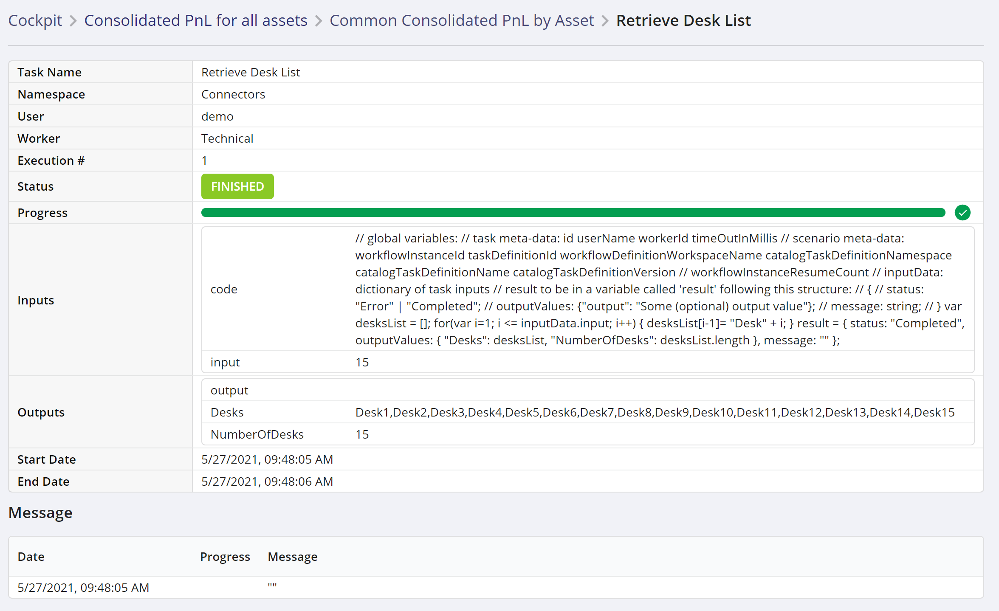

The first part of the view is a table of task attributes (name, worker, status,
etc) and task parameters (input/output).

* **input parameters** may have values or not, depending on the overall status of
  this scenario run. When a task input is defined as a reference to the output
  of some other task, a value will be displayed here if the other task has
  finished its execution, and produced its result. Otherwise this field will be
  empty.
* **output parameters** are produced when a task finishes its execution. They
  are sent by the worker program, to the Scenario engine, in a TaskStatusEvent
  object, with status **Completed** (if the task’s execution finished without
  errors). If a task finishes in an error state, then the output data is not
  produced.

The second part of the view displays messages sent by the worker program during
task execution (with **InProgress** status, or at the end of its execution
(with **Completed** status).
